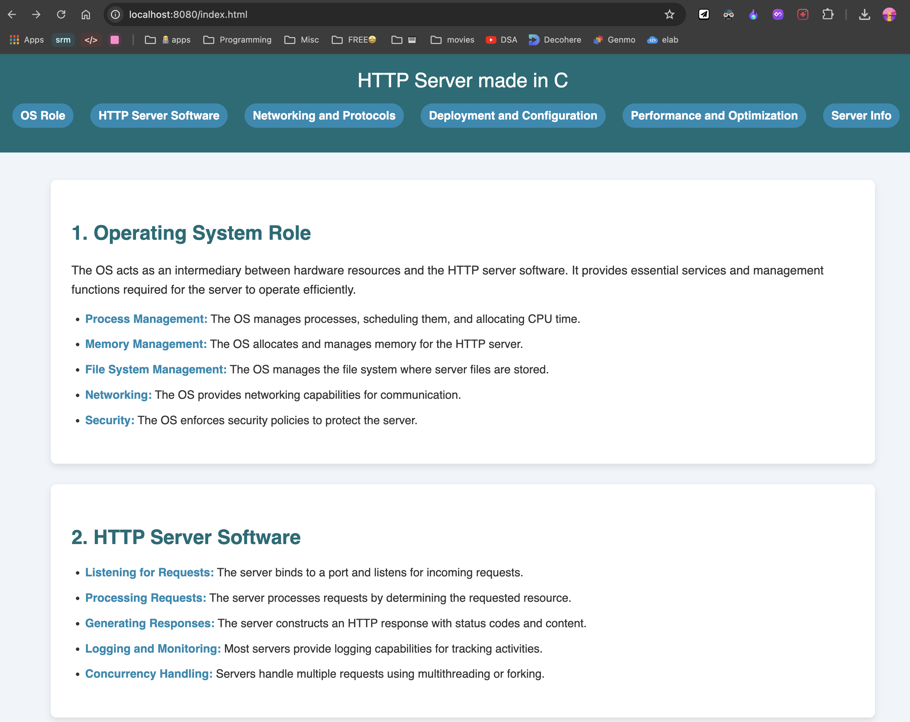
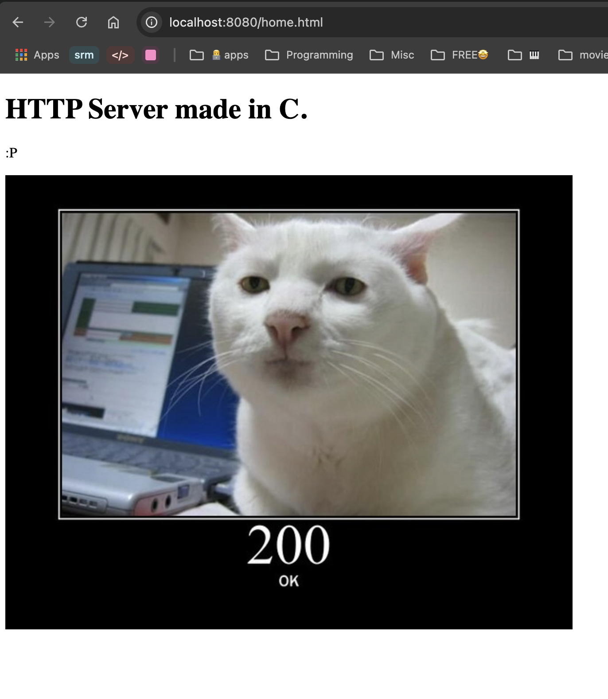
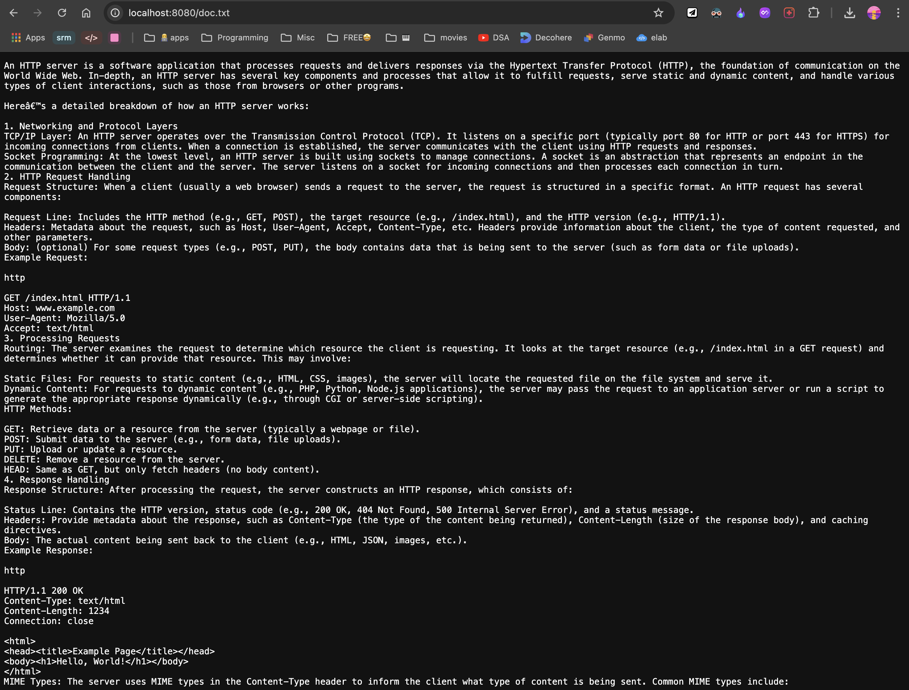

# Multi-threaded HTTP Server in C

This project implements a basic multi-threaded HTTP server in C, capable of serving static files from the filesystem. It
listens for incoming client requests, processes `GET` requests, and responds with the requested files or if the file is
not found, the server sends a `404 Not Found` response.

This project is a multi-threaded HTTP server in C that uses socket programming, multi-threading with `pthread`, and file
handling to serve files over HTTP. It implements several key operating system concepts, such as process management (
through threads), memory management (through dynamic allocation), and resource handling (sockets and files).

## Features

- **Multi-threading**: Handles each client request in a separate thread using `pthread`.
- **Socket Programming**: Uses low-level socket programming to manage client connections.
- **File Handling**: Serves files to clients and handles file `I/O` using system calls.
- **Memory Management**: Dynamically allocates memory for buffers and cleans up after use.
- **HTTP Response Generation**: Serves files with appropriate `MIME` types based on their extensions.

## Key OS Concepts

1. **Multi-threading**: Each client request is handled in a separate thread, demonstrating process/thread management in
   OS.
   This allows the server to handle multiple clients simultaneously.
2. **Socket Programming**: The server uses low-level socket programming to manage network communication. The socket(),
   bind(),
   listen(), accept(), and recv() system calls are used to manage connections.
3. **File Handling**: The server opens, reads, and serves files to clients. It uses the open(), read(), and close()
   system
   calls to interact with files.
4. **Memory Management**: The server dynamically allocates memory for buffers and socket descriptors using malloc() and
   frees
   the memory using free() after the request is processed.

## Threading

The server uses `POSIX` threads to handle multiple clients concurrently.

Compile the server using `gcc`:

```bash
gcc -o server server.c
```

Run the server:

```bash
./server
```

The server will start listening on port `8080`.

Access the server from your browser at http://localhost:8080/index.html

| Endpoint      |                              |
|---------------|------------------------------|
| `/index.html` |  |
| `/home.html`  |    |
| `/doc.txt`    |      |
| `/openme`     |                              | 

